1. Seleccionar una API: [ReqRes](https://reqres.in)
2. Crear una cuenta y generar la clave de autenticación necesaria para acceder a la API
    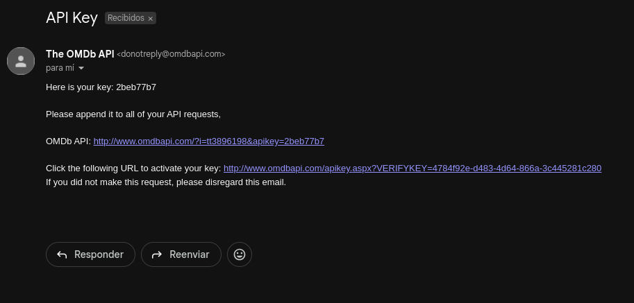

3. Una vez seleccionada la API, se deben seguir los siguientes pasos:

    a. Generar una consulta GET genérica para obtener datos de la API, por ejemplo, listar todas las películas disponibles: 
        - GET/https://reqres.in/api/users

    Resultado:
        
    ```json
        {
            "page": 1,
            "per_page": 6,
            "total": 12,
            "total_pages": 2,
            "data": [
                {
                    "id": 1,
                    "email": "george.bluth@reqres.in",
                    "first_name": "George",
                    "last_name": "Bluth",
                    "avatar": "https://reqres.in/img/faces/1-image.jpg"
                },
                {
                    "id": 2,
                    "email": "janet.weaver@reqres.in",
                    "first_name": "Janet",
                    "last_name": "Weaver",
                    "avatar": "https://reqres.in/img/faces/2-image.jpg"
                },
                ...
            ],
            "support": {
                "url": "https://reqres.in/#support-heading",
                "text": "To keep ReqRes free, contributions towards server costs are appreciated!"
            }
        }
    ```
    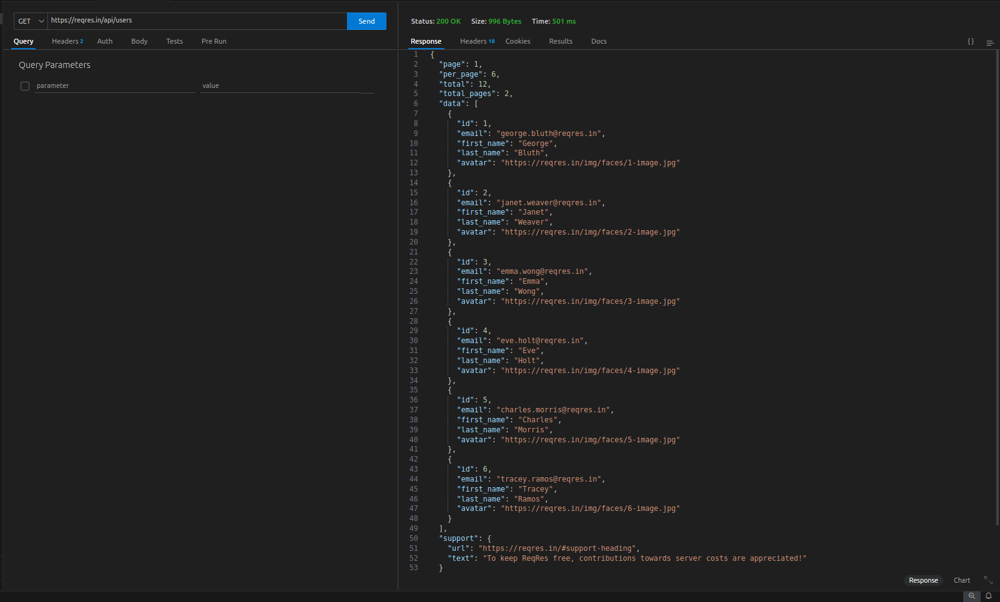


    b. Crear consultas POST y PUT para modificar datos en la API: 

    - POST: JSON Content:
        ```json
            {
                "name": "John Doe",
                "job": "Software Engineer"
            }
        ```
        
        Devuelve:
        
        ```json
            {
                "name": "John Doe",
                "job": "Software Engineer",
                "id": "220",
                "createdAt": "2024-05-10T12:39:38.869Z"
            }
        ```
    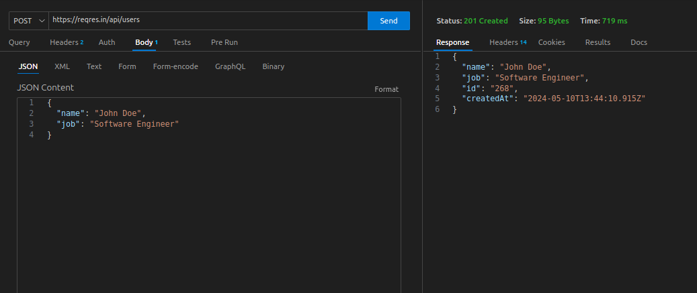

    - PUT: URL: https://reqres.in/api/users/12 
        JSON Content:
            
        ```json
            {
                "name": "Jane Doe",
                "job": "Product Manager"
            }
        ```

        Devuelve:

        ```json
                {
                    "name": "John Doe",
                    "job": "Product Manager",
                    "updatedAt": "2024-05-10T12:45:08.299Z"
                }
        ```
    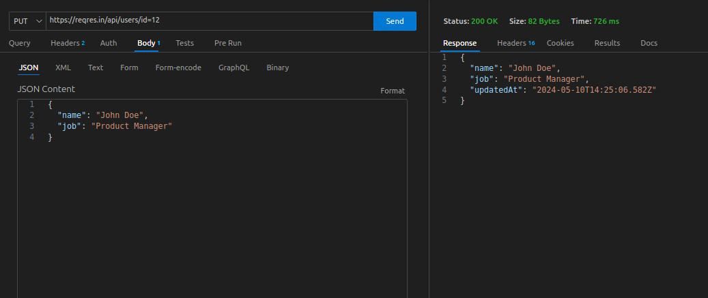

    c. Realizar una consulta GET de búsqueda utilizando parámetros de URL, como por ejemplo, búsqueda por ID:
        - URL: https://reqres.in/api/users?id=3

    Devuelve:
        
    ```json
        {
            "data": {
                "id": 3,
                "email": "emma.wong@reqres.in",
                "first_name": "Emma",
                "last_name": "Wong",
                "avatar": "https://reqres.in/img/faces/3-image.jpg"
            },
            "support": {
                "url": "https://reqres.in/#support-heading",
                "text": "To keep ReqRes free, contributions towards server costs are appreciated!"
            }
        }
    ```
    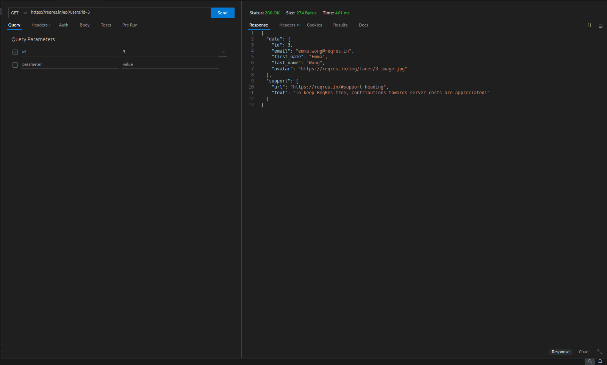
    
    d. Realizar una consulta de búsqueda utilizando al menos dos claves de consulta distintas:
        - URL: https://reqres.in/api/users?id=3&firs_name=Emma

        
    Devuelve:
        
    ```json
        {
            "data": {
                "id": 3,
                "email": "emma.wong@reqres.in",
                "first_name": "Emma",
                "last_name": "Wong",
                "avatar": "https://reqres.in/img/faces/3-image.jpg"
            },
            "support": {
                "url": "https://reqres.in/#support-heading",
                "text": "To keep ReqRes free, contributions towards server costs are appreciated!"
            }
        }
    ```
    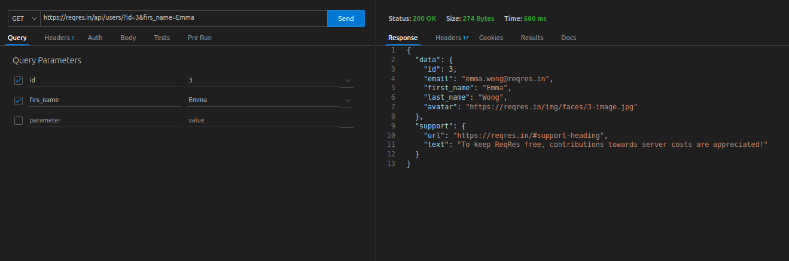

    e. Realizar una consulta de búsqueda lógica, por ejemplo, encontrar películas con una calificación de más de 3 estrellas:
    
    ```python
        import requests

        response = requests.get("https://reqres.in/api/users")
        usuario = response.json()["data"]

        filtrar = [user for user in usuario if len(user["first_name"]) > 5]

        for usuarios in filtrar:
            print(usuarios)
    ```
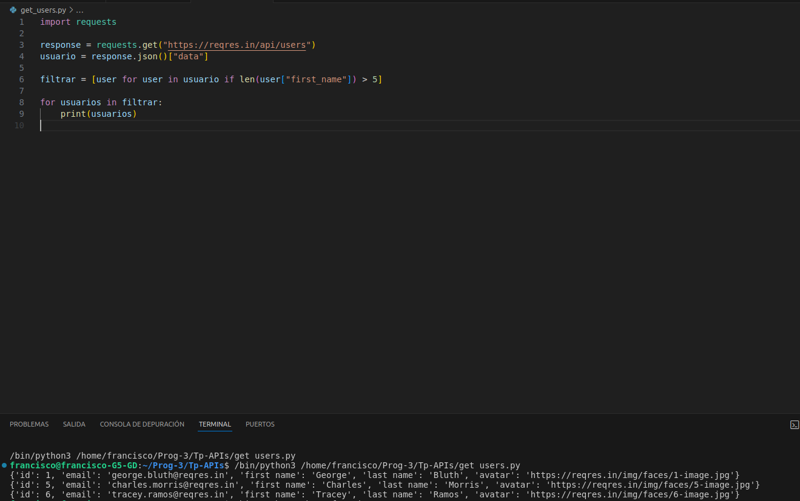

4. Consumir los puntos finales de la API utilizando algún cliente de interfaz para realizar pruebas.

    1- https://reqres.in/api
    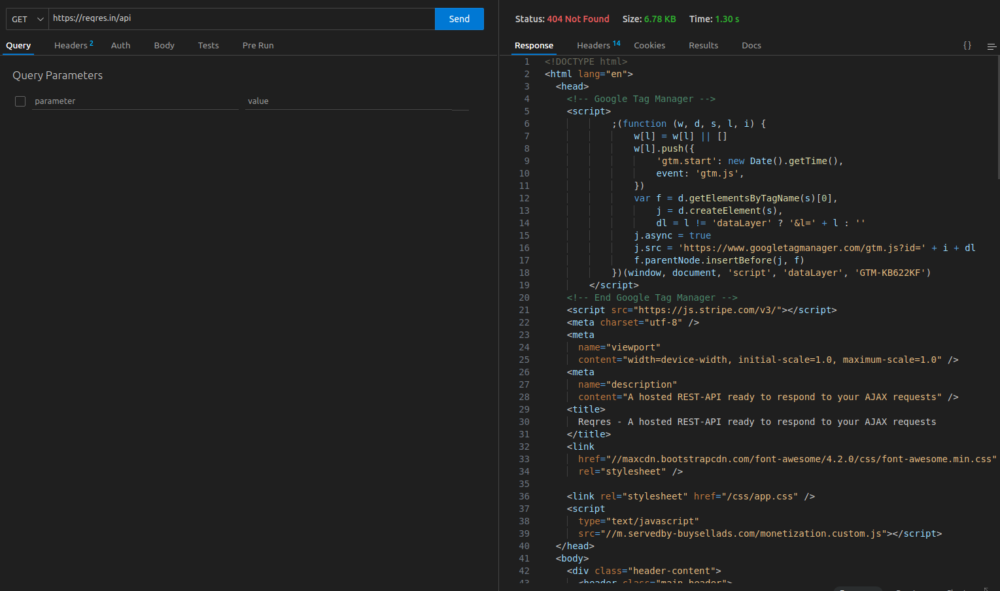

    2-https://reqres.in/api/users
    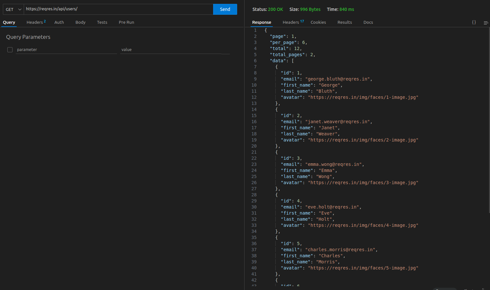

    3-https://reqres.in/api/users/?page=2
    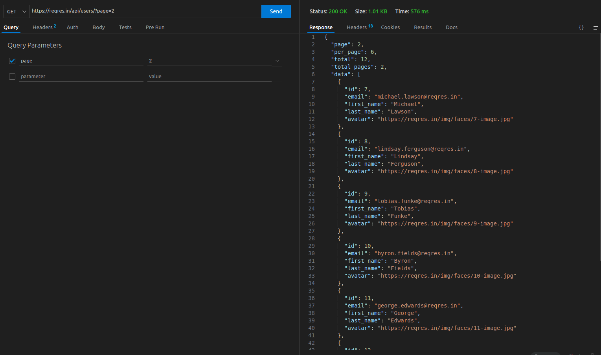

    4-https://reqres.in/api/users/?page=2&id=8
    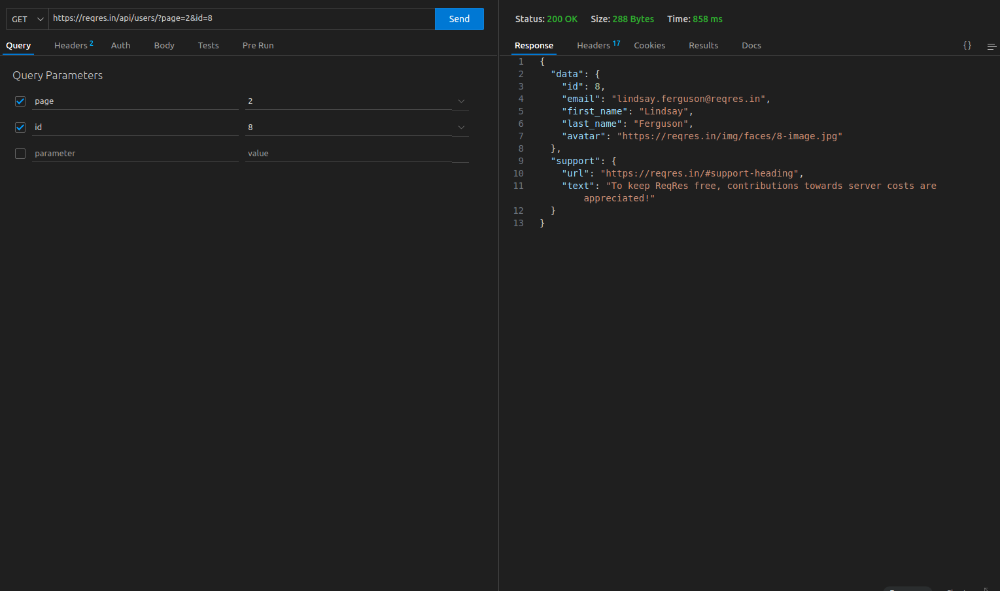

5. Utilizar los puntos finales funcionales para desarrollar un proyecto en Python que muestre estos datos en forma de tablas o tarjetas. Se puede optar por generar un archivo PDF o una página web sencilla que muestre los resultados obtenidos mediante los puntos finales.

    ```python
    import requests
    import pandas as pd
    from weasyprint import HTML

    # Obtener datos de la API ReqRes
    response = requests.get("https://reqres.in/api/users")
    data = response.json()["data"]

    # Procesar los datos
    df = pd.DataFrame(data)

    # Generar tabla HTML
    html_table = df.to_html()

    # Generar archivo PDF
    HTML(string=html_table).write_pdf("usuarios.pdf")
    ```